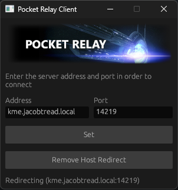

# Pocket Relay Client

## 📌 Issues

When used with the current server implementation the external address configuration value
will have to be correct or features like Galaxy At War, Shop Icons, Etc won't work. This is
planned to be fixed in the next iteration of this client which will create proxies for any
of the additional servers fixing this issue

## ❔What

This is a tool for Redirecting your local Mass Effect 3 clients to an Unofficial server. The
address and port you put into this tool will be the address and port that the Mass Effect 3
client receives. This tool relies on creating a hosts file redirect for gosredirector.ea.com
to 127.0.0.1 and this client spawns a local server which Hijacks the redirect process.

## ❔How

This tool uses the system hosts file at `C:/Windows/System32/drivers/etc/hosts` and adds
`127.0.0.1 gosredirector.ea.com` which tells your computer to send all the traffic that
would normally go to `gosredirector.ea.com` to `127.0.0.1` (Your computer) then this tool
runs a local server using [BlazeSSL (https://github.com/jacobtread/blaze-ssl)](https://github.com/jacobtread/blaze-ssl)
and pretends to be the official Mass Effect 3 servers.

## 🔌Requirements

In order to use this tool your Mass Effect 3 game must be patched with the Blinkw32 proxy DDL
you can find details about this
here: [https://github.com/Erik-JS/masseffect-binkw32](https://github.com/Erik-JS/masseffect-binkw32)

## 📸 Screenshot

## 🧾 License

The MIT License (MIT)

Copyright (c) 2022 Jacobtread

Permission is hereby granted, free of charge, to any person obtaining a copy
of this software and associated documentation files (the "Software"), to deal
in the Software without restriction, including without limitation the rights
to use, copy, modify, merge, publish, distribute, sublicense, and/or sell
copies of the Software, and to permit persons to whom the Software is
furnished to do so, subject to the following conditions:

The above copyright notice and this permission notice shall be included in all
copies or substantial portions of the Software.

THE SOFTWARE IS PROVIDED "AS IS", WITHOUT WARRANTY OF ANY KIND, EXPRESS OR
IMPLIED, INCLUDING BUT NOT LIMITED TO THE WARRANTIES OF MERCHANTABILITY,
FITNESS FOR A PARTICULAR PURPOSE AND NONINFRINGEMENT. IN NO EVENT SHALL THE
AUTHORS OR COPYRIGHT HOLDERS BE LIABLE FOR ANY CLAIM, DAMAGES OR OTHER
LIABILITY, WHETHER IN AN ACTION OF CONTRACT, TORT OR OTHERWISE, ARISING FROM,
OUT OF OR IN CONNECTION WITH THE SOFTWARE OR THE USE OR OTHER DEALINGS IN THE
SOFTWARE.ECTION WITH THE SOFTWARE OR THE USE OR OTHER DEALINGS IN THE SOFTWARE.