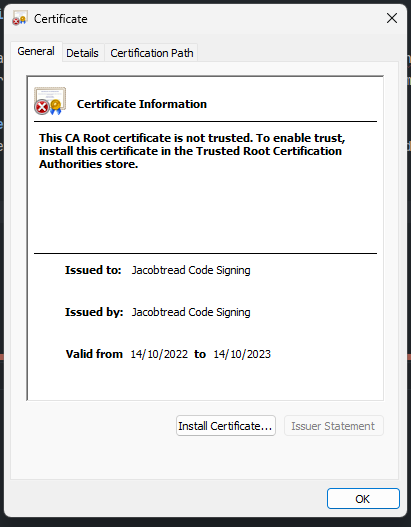
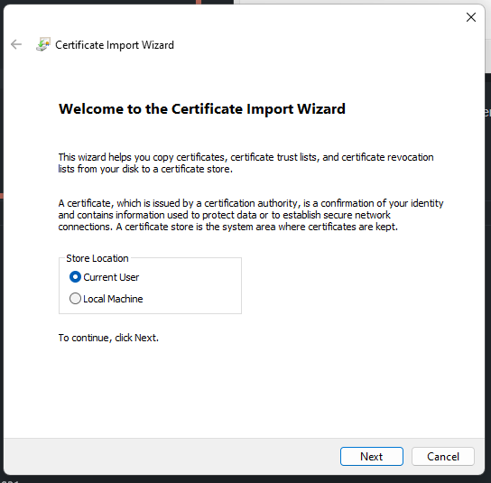
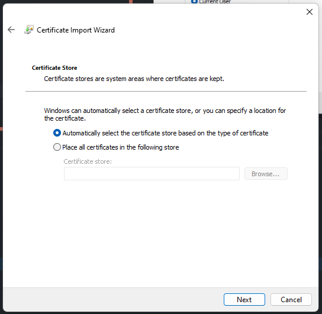
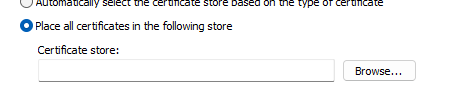
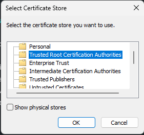
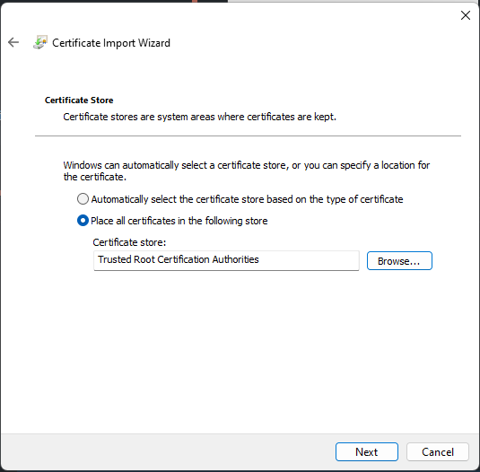
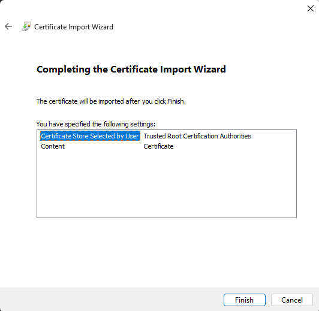
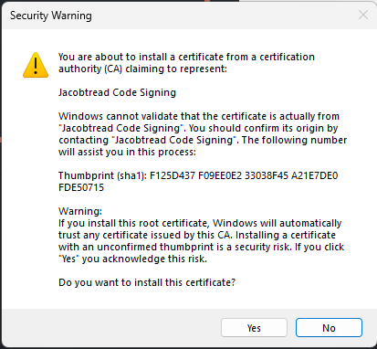
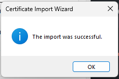

# Installing CA Certificate

This is a tutorial for installing the Root CA signing certificate for this Redirector tool. This if for if
Windows is preventing you from running the tool with the "Unknown Publisher" message.

## 1) Download Certificate

First you must download the self-signed certificate that I use to sign the pre-built binaries for this software.
You can download it from here https://github.com/PocketRelay/Client/raw/master/signing/Jacobtread.cer

## 2) Open Certificate
Next you must open the certificate by double-clicking (Or right click and "Open") this will display the
following window:

On this screen you should push the "Install Certificate" button

## 3) Installation

After pressing the "Install Certificate" button the following screen will appear
On this screen press "Next" to continue.

This next screen will appear asking you where you would like to store the certificate.
In order for windows to accept this signing certificate you need to push the 
"Place all certificates in the following store" check box

After selecting this click the "Browse" button.

The following list of stores will pop up from this list select te "Trusted Root Certification Authorities" option
and press the "Ok" button

With the correct store now selected push the "Next" button to continue

You will get this "Completing the Certificate Import Wizard" prompt here push "Finish"

You will then get a "Security Warning" from Windows prompting you to confirm the certificate installation
press "Yes" to install the certificate

You will then get a "The import was successful." message when it is installed

## 4) All Done
You can now close all the Windows that are left open by pressing the "Ok" buttons, and 
you should now be able to run the Redirector executable without any problems.